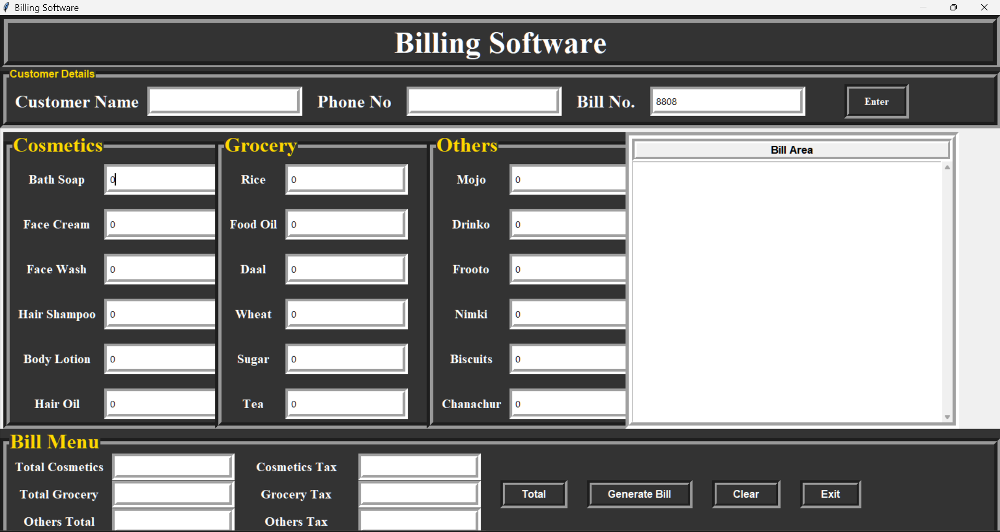
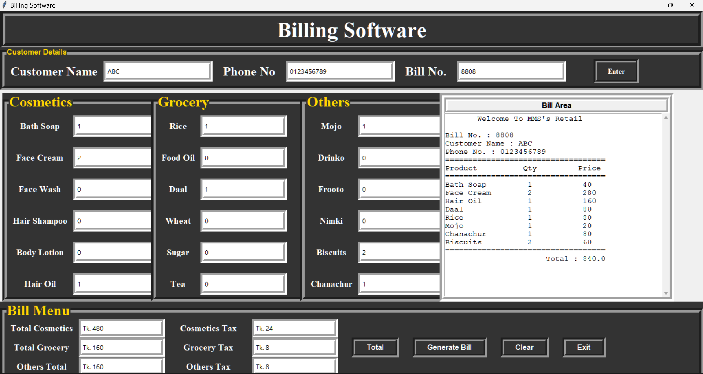

# Python Retail Billing System

A desktop-based billing application built using Python and Tkinter.  
This project provides a simple graphical interface for managing customer details, calculating product bills, applying taxes, and generating itemized invoices.

---

## Features

### Customer Management
- Customer name input
- Phone number input
- Auto-generated unique bill number

### Product Categories

#### Cosmetics
- Bath Soap  
- Face Cream  
- Face Wash  
- Hair Shampoo  
- Body Lotion  
- Hair Oil  

#### Grocery
- Rice  
- Daal  
- Food Oil  
- Wheat  
- Sugar  
- Tea  

#### Others
- Mojo  
- Drinko  
- Frooto  
- Nimki  
- Chanachur  
- Biscuits  

---

## Billing Features

- Automatic total calculation per category  
- Tax calculation (5% applied per category)  
- Item-wise invoice generation  
- Real-time bill display  
- Clear and reset functionality  

---

## Technologies Used

- Python  
- Tkinter (GUI Library) 
- Object-Oriented Programming (OOP)

---

## 📷 Screenshots

### 🖥 Main Interface

### 🧾 Generated Bill

---

## Key Concepts Demonstrated

- GUI development using Tkinter  
- Event-driven programming  
- Object-Oriented Design (Classes & Methods)  
- Input handling using Tkinter variables  
- Basic accounting logic implementation  

---

## Future Improvements

- Export bill as PDF invoice  
- Save customer history using database (SQLite)  
- Product inventory management system  
- Search previous bills  
- Sales analytics dashboard  
- Improved UI design using modern frameworks  

